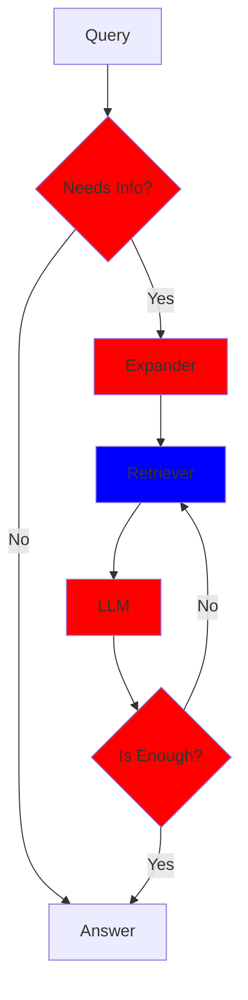
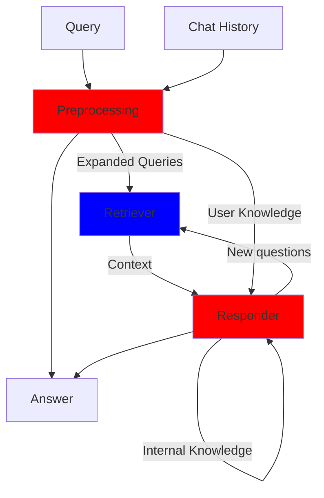

# op-brains

## The package

This package contains the core components of the chatbot system and the summarizer. The package is structured as follows:

```plaintext
├── op_brains                      # Main project directory containing all the core components.
│   ├── chat                       # Module handling the chatbot's core logic.
│   │   ├── model_utils.py         # Utility functions related to model management and interactions.
│   │   ├── system_structure.py    # Defines the architecture of the chat system, including query handling.
│   │   └── utils.py               # General utility functions for the chat module. Is used for running the chat.
│   ├── config.py                  # Configuration settings for the system.
│   ├── documents                  # Module for handling document processing.
│   │   ├── __init__.py            # Defines which are going to be the sources of the chat.
│   │   └── optimism.py            # Handles document parsing and processing for Optimism-related documents.
│   ├── README.md                  # This file.
│   ├── retriever                  # Module responsible for information retrieval from various sources.
│   │   ├── connect_db.py          # Handles connections to the document database for query processing.
│   │   └── connect_faiss.py       # Handles interactions with the FAISS index for vector-based retrieval.
│   ├── setup.py                   # Script to set up the chat, creating the FAISS databases and the indexes.
│   └── summarizer                 # Module for summarizing retrieved documents and user interactions.
│       ├── summarize_all_threads.py # Summarizes all forum threads.
│       ├── summarizer.py          # Main logic for summarizing a forum thread.
│       └── utils.py               # Utility functions specific to the summarizer module.
```

## The Chat

The chat is a RAG (Retriever Augmented Generation) system. A basic flowchart of the system is the following:



- Some explanations, block by block:
  - **Needs Info**: For each user query, the first thing the system should ask itself is whether it needs to trigger the retriever to fetch information. We want to minimize unnecessary queries. Here are some cases where the answer is no:
    - The user is simply interacting with the chat. (e.g., “Hi!”)
    - The query refers only to information already present in the conversation history (e.g., “Summarize your last responses”)
    - The user asks a question about a topic unrelated to Optimism (e.g., “Is it cold today?”)
  - **Expander**: In cases where it is necessary to retrieve information, this block breaks the query into simple questions and keywords that approach the required information.
    - The expander also attempts to summarize, based on the conversation history, the user's knowledge. The expander also select the type of information that is being requested (2 are implemented, factual and recent).
  - **Retriever**: Fetches the information.
    - This block works differently depending on the type of query and the number of iterations the system has gone through (we call these iterations "reasoning levels").
      - At the first reasoning level, the retriever fetches information from the indexes. Those indexes are built from iterating the documents in the database, listing, for a list of relevant questions and keywords, the documents that are expected to contain the answer.
        - If the type of information requested is factual, the retriever fetches the top documents (in term of distance in the embedding space) that are expected to contain the answer.
        - If the type of information requested is recent, the retriever fetches the most recent documents that are expected to contain the answer.
      - At the following reasoning levels, the retriever fetches information from the FAISS database.
  - **LLM + Is Enough**: Elaborates the response based on the context. If it doesn't consider the context sufficient, it generates new questions and queries the retriever again. It maintains a summary of its current knowledge for future iterations.

The red parts that chain together collapse into a single prompt (preprocessing = needs info + expander, responder = llm + is enough). The following (rather ugly) flowchart illustrates the system a bit more faithfully:



## The Summarizer

The summarizer is a simple module that summarizes the forum threads. It accesses also the snapshot proposals that are linked to some forum threads.
